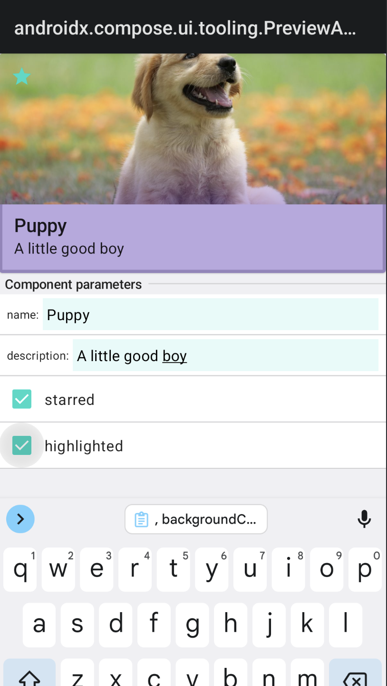

## Compose Dynamic Preview

Enhance Preview experience by generating interactive previews.

### Interactive previews

Interactive previews provide the interface to display a component
under different circumstances. Enter the parameters and change
the component appearance at real time!




This way you can check all the component changes,
without the need to write a boilerplate preview each time.

Currently, the following parameter types are supported:

- `Boolean?`
- `String?`

For now, you can't write any converters to support other types. 

### Usage

#### In place

1. Add `@DynamicPreview` annotation to a component
2. Add `@DynamicPreviewParameter` annotation to preview parameters
3. Add default values to the remaining parameters

```kotlin
@Composable
@DynamicPreview
fun Component(
    @DynamicPreviewParameter
    enabled: Boolean,
    @DynamicPreviewParameter
    label: String?,
    colors: ComponentColors = defaultColors()
)
```

#### As meta-annotation

The processor supports using `api` annotations as meta-annotations –
you can set up your own `DynamicPreview` with parameters:

```kotlin
@Preview(uiMode = Configuration.UI_MODE_NIGHT_NO, backgroundColor = 0xFFFFFFFF)
@Preview(uiMode = Configuration.UI_MODE_NIGHT_YES, backgroundColor = 0xFF1A1A1A)
annotation class SamplePreview

@DynamicPreview
@DynamicPreview.PreviewClass(SamplePreview::class)
@DynamicPreview.Wrapper(SampleDynamicPreview.Companion::class)
annotation class SampleDynamicPreview {

    companion object {

        @Composable
        fun Wrapper(content: @Composable () -> Unit) {
            SampleTheme {
                Column {
                    content()
                }
            }
        }
    }
}
```

When the preview annotation is ready, you can use it to preview your components:

```kotlin
@Composable
@SampleDynamicPreview
fun DogCard(
    @DynamicPreviewParameter
    name: String,
    @DynamicPreviewParameter
    description: String,
    @DynamicPreviewParameter
    starred: Boolean,
    @DynamicPreviewParameter
    highlighted: Boolean,
    modifier: Modifier = Modifier,
    image: Painter = painterResource(id = R.drawable.dog1),
    onClick: () -> Unit = {},
    onStarClick: () -> Unit = {},
) { ... }
```

### Dynamic Preview Anatomy

Let's have a look on the generated preview:

```kotlin
private class DogCard_Properties {
    public var name: String by mutableStateOf("")

    public var description: String by mutableStateOf("")

    public var starred: Boolean by mutableStateOf(false)

    public var highlighted: Boolean by mutableStateOf(false)

    public val list: List<KMutableProperty0<*>> = listOf(
        ::name, ::description, ::starred,
        ::highlighted
    )
}

@Composable
@SamplePreview
private fun DogCard_DynamicPreview(): Unit {
    val properties = remember {
        DogCard_Properties()
    }
    com.daniily.preview.sample.preview.SampleDynamicPreview.Companion.Wrapper {
        DogCard(
            name = properties.name,
            description = properties.description,
            starred = properties.starred,
            highlighted = properties.highlighted
        )
        properties.list.PropertySwitchers()
    }
}
```

It contains of two parts:

1. Component properties – the properties which may be changed in preview app
2. Preview function – the function which displays the component and its parameters

The generated preview function may be configured by two annotations:

1. `@DynamicPreview.PreviewClass` – a Compose `@Preview` annotation to mark preview function with
2. `@DynamicPreview.Wrapper` – a `@Composable` function to wrap component and properties with

Wrapper function is a `@Composable` function, which accepts `content: @Composable () -> Unit`
parameter, where `content` is the preview component and its property switchers. You can use
`Wrapper` function to define theme and preview layout. If not set, `Column` function is used.

## Compose Dynamic Preview Plugin

To improve the user experience of using the library, a, Intellij plugin has been build.
The plugin is capable of detecting Dynamic Preview usages, offering `Build` icon when
the the preview function has not been generated yet, and `Run` button to open the generated
preview. 

### Sample app

Look at `:sample` module to see the usages of Compose Dynamic Preview.

- See [AppBar.kt](../sample/src/main/kotlin/com/daniily/preview/sample/view/AppBar.kt) for
  the in-place usage example
- See [DogCard.kt](../sample/src/main/kotlin/com/daniily/preview/sample/view/DogCard.kt) for
  using meta-annotations
